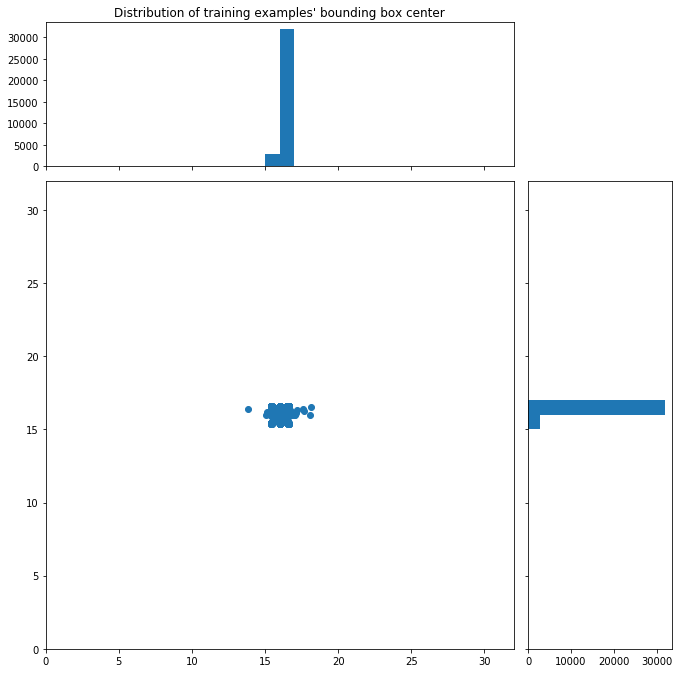

# Traffic Sign Recognition Classifier

In this project I have successfully developed a classifer for German traffic signs using convolutional neural network. This writeup will explain all the steps required to finish this project.

---

**Build a Traffic Sign Recognition Project**

The goals / steps of this project are the following:
* Load the data set (see below for links to the project data set)
* Explore, summarize and visualize the data set
* Design, train and test a model architecture
* Use the model to make predictions on new images
* Analyze the softmax probabilities of the new images
* Summarize the results with a written report

## Rubric Points
Here I will consider the [rubric points](https://review.udacity.com/#!/rubrics/481/view) of this project individually and describe how I addressed each point in my implementation.  

---
### Submission Files

#### 1. The project submission includes all required files.

All the required files are managed using git with github providing the project repository. Here is a link to my [project code](https://github.com/FurqanHabibi/CarND-Traffic-Sign-Classifier-Project/blob/master/Traffic_Sign_Classifier.ipynb).

### Dataset Exploration

#### 1. The submission includes a basic summary of the data set.

I used the numpy library to calculate summary statistics of the traffic signs data set:

* The size of training set is 34799
* The size of the validation set is 4410
* The size of test set is 12630
* The shape of a traffic sign image is (32, 32, 3)
* The number of unique classes/labels in the data set is 43

#### 2. The submission includes an exploratory visualization on the dataset.

First I visualized the data count of each class to see if we have a fairly distributed dataset or not.

As we can see above, the training dataset is not really fairly distributed across the class. This will make the model to unfairly favor classes which are more well represented.

To get the feeling of the training dataset, I visualized 10 random samples of 5 of it's randomly selected class.

As we can see above, the training dataset is pretty varied, with many differences in brightness and angles.

To also confirm the variation of the signs position inside it's image, I also visualized the center and the size of it's bounding box.

We can see that the bounding box of the dataset's images mostly lies at the center of the image, which means that the model trained on it will unfairly favor signs that are in the center of an image. To solve this we may need to augment our data later with some shifts on the image.

Also we can see that size of the bounding box related to the size of it's image is fairly large, around 22-26 of the image's 32 pixel. To make our model robust to small signs, we may need to augment our data later with some zoom-out on the image.

### Design and Test a Model Architecture

#### 1. The submission describes the preprocessing techniques used and why these techniques were chosen.

Based on [this paper](http://yann.lecun.com/exdb/publis/pdf/sermanet-ijcnn-11.pdf) by Pierre Sermanet and Yann LeCun (2011), using a color dataset doesn't really improve the accuracy, and also by the simple fact that grayscale images are much faster to process because of their smaller size, then I decided to grayscale the image by taking the Y channel of it's YCbCr representation.

Also, by seeing some of the random samples above, we cann see that some images are not really well lit, which may make recognition more difficult. To counter that, I decided to apply a local histogram equalization by using equalize_adapthist function of scikit-image.

Finally, I also apply normalization which is a fairly standard preprocessing step for machine learning.

This is a sample of an image which have gone through the preprocesing steps explained above.

As I have touched on above, the dataset provided here is not really well ditributed among it's classes. Also the total number of the dataset is not really enough to develop a fairly accurate classifier. To solve that, I decided to do augmentation on the training dataset.

The first augmentation is flipping. I have found that some of the class, when flipped will produce a valid data, may it be the same class or a different class. 

Classes like [Right-of-way at the next intersection] will produce the same class when flipped horizontally.

Classes like [Speed limit (30km/h)] will produce the same class when flipped vertically.

Classes like [Keep right] will produce [Keep left] when flipped horizontally.

While some class like [End of all speed and passing limits] will produce the same class when flipped horizontally then vertically.

With all the flipping tricks used above, we have increase the number of training dataset from 34799 to 59788 images.

To increase it further I decided to rotate the images slightly in the range of -15 degrees to 15 degrees. With this rotation, the number of the dataset is further increased to 298940 images.

#### 2. The submission provides details of the characteristics and qualities of the architecture, including the type of model used, the number of layers, and the size of each layer. Visualizations emphasizing particular qualities of the architecture are encouraged.

I decided to design a model based on the aforementioned Pierre Sermanet and Yann LeCun (2011) paper. This model has 3 convolutional layers and 1 fully connected layers on the classifier. Also unlike traditional convolutional layers, using technique discussed on the above paper, I also connect the pooled outputs of all connected layers to the fully connected layers.

The detail of my model are as follow:

| Layer         		|     Description	        					| 
|:---------------------:|:---------------------------------------------:| 
| Input         		| 32x32x1 Grayscale image   					| 
| Convolution 5x5     	| 1x1 stride, same padding, outputs 32x32x32 	|
| RELU					|												|
| Max pooling    ...A	| 2x2 stride,  outputs 16x16x32 				|
| Convolution 5x5	    | 1x1 stride, same padding, outputs 16x16x64 	|
| RELU					|												|
| Max pooling    ...B	| 2x2 stride,  outputs 8x8x64    				|
| Convolution 5x5	    | 1x1 stride, same padding, outputs 8x8x128 	|
| RELU					|												|
| Max pooling    ...C	| 2x2 stride,  outputs 4x4x128    				|
| Flatten       		| A with max pooling 4x4, output 4x4x32        	|
|                       | B with max pooling 2x2, output 4x4x64         |
|                       | C, output 4x4x128                             |
|                       | Flatten + Concat, final output 3584           |
| Fully Connected       | Output 1024                                   |
| Softmax				| Output 43  									|

To minimize overfitting of my model to the training data, I used dropout and L2 regularization on the fully connected layer. 

#### 3. The submission describes how the model was trained by discussing what optimizer was used, batch size, number of epochs and values for hyperparameters.

For training, I set the number of epochs to 50, with 128 batch size and 0.001 learning rate. To initialize all the variables, I used tf.truncated_normal with mean of 0 and standard deviation of 0.1. For the dropout layer I set the keep probability at 0.5, and for L2 regularization the beta is 0.01. For the training optimizer, I choose the widely used AdamOptimizer. I didn't used early stopping here, but instead decided to run all 50 epochs and then choose the model with the smallest cross entropy.

#### 4. The submission describes the approach to finding a solution. Accuracy on the validation set is 0.93 or greater.

My final model results were:
* training set accuracy of 1.0000
* validation set accuracy of 0.9880
* test set accuracy of 0.9817

The steps taken to reach the final solution are as follow:
* I first decided to design an architecture based on the Pierre Sermanet and Yann LeCun (2011) paper mentioned above. There are a couple of reasons why I chose this:
  - The problem being tackled is the exact same problem, that is recognition of german traffic sign.
  - The accuracy mentioned on the paper is very high, well higher than the 0.93 lower limit set on this project.
  - The authors of the paper are some of the most respected member of the Computer Vision community.
  - The idea of branching output from convoluted layer directly to the fully connected layer is interesting for me. Because the outputs of earlier layer will provide better global activations then the more detailed and localized outputs of the later layers, surely it wouldn't hurt to also use them on the final connected layer.
* With just the basic architecture above, without any data augmentation and regularization, I got around ~80% accuracy on the validation set.
* I then proceed to implement data augmentation with detail explained above. With data augmentation in place, the original 34799 training data is increased around 8-9 times, becoming 298940 of training data. With this training data, I can get around 90% accuracy on the validation set.
* Meanwhile, the accuracy on the training set is already reaching 1.0, which might signal an overfitting on the training data. To combat this I then incorporate dropouts and L2 regularization. With this in place, I can get around 95% accuracy on the validation set.
* Finally, I then increase the number of epochs from 10 to 50, tune the hyperparameters a bit, and then decided to choose the model when the cross entropy ends up the smallest. I decided to use cross entropy as the basis for my decision instead of the validation accuracy, in hope of getting the model that generalize better to unseen data. With this setup, I finally get 98.8% accuracy on the validation set.
* I then run the model against the provided test set and get 98.17% accuracy.

### Test a Model on New Images

#### 1. The submission includes five new German Traffic signs found on the web, and the images are visualized. Discussion is made as to particular qualities of the images or traffic signs in the images that are of interest, such as whether they would be difficult for the model to classify.

Here are six German traffic signs that I found on the web:

   
  

The [Children crossing] image might be difficult to classify because it's not actually a german traffic sign. Even though human can clearly see that it's a children crossing sign, the subtle differences on the image might throw the classifier off and confuse it with other class entirely.

#### 2. The submission documents the performance of the model when tested on the captured images. The performance on the new images is compared to the accuracy results of the test set.

Here are the results of the prediction:

| Image			        |     Prediction	        					| 
|:---------------------:|:---------------------------------------------:| 
| Speed limit (60km/h)      		| Speed limit (60km/h)   									| 
| Right-of-way at the next intersection     			| Right-of-way at the next intersection 										|
| Priority road					| Priority road											|
| Yield	      		| Yield					 				|
| Road work			| Road work      							|
| Children crossing			| Children crossing      							|

The model was able to predict 6 of the 6 traffic signs, which gives an accuracy of 100%. This compares favorably to the accuracy on the test set of 98.17%

#### 3. The top five softmax probabilities of the predictions on the captured images are outputted. The submission discusses how certain or uncertain the model is of its predictions.

For the first image, the model is very sure that this is a Speed limit (60km/h) sign (probability of 98.03%), and the image does contain a Speed limit (60km/h) sign. The top five soft max probabilities were:

For the second image, the model is very sure that this is a Right-of-way at the next intersection sign (probability of 98.03%), and the image does contain a Right-of-way at the next intersection sign. The top five soft max probabilities were:

For the third image, the model is very sure that this is a Priority road sign (probability of 98.03%), and the image does contain a Priority road sign. The top five soft max probabilities were:

For the fourth image, the model is very sure that this is a Yield sign (probability of 98.03%), and the image does contain a Yield sign. The top five soft max probabilities were:

For the fifth image, the model is very sure that this is a Road work sign (probability of 98.03%), and the image does contain a Road work sign. The top five soft max probabilities were:

For the sixth image, the model is very sure that this is a Children crossing sign (probability of 98.03%), and the image does contain a Children crossing sign. The top five soft max probabilities were:

As discussed before, because the signs is not an actual german traffic sign, which differ slightly, the classifier does ge a little confuse with the Beware of ice/snow which at a glance does look like the Children crossing sign above.

